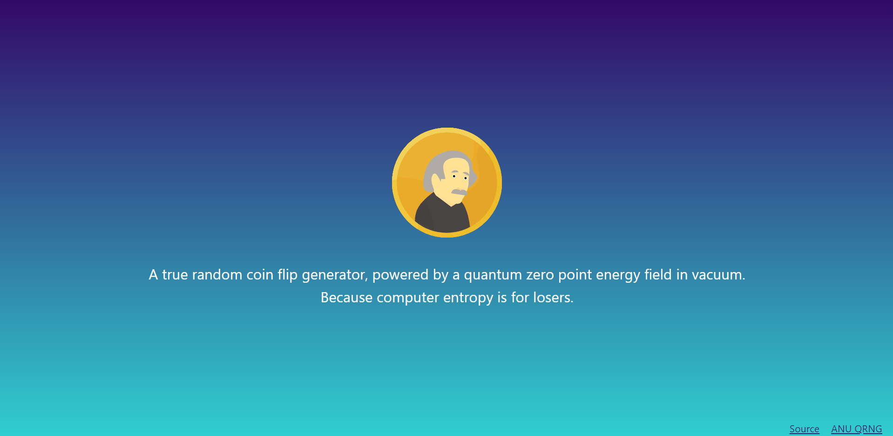

# Quantum Zero Point Energy Field Coin Flipper

A true random coin flip generator, powered by a quantum zero point energy field in vacuum.
Because computer entropy is for losers.

## The "Problem"

Computers can generate random numbers through RNG systems by observing data like cpu amps at given time or some fraction of the system time, which is not easy to predict. But at the end of the day, they are only pseudorandom numbers. Not good enough.

## How it works

Using the [ANU QRNG](https://qrng.anu.edu.au/) API, the random numbers are generated in real-time at the lab by measuring the quantum fluctuations of the vacuum, that are REALLY random.

## Prerequisites

You will need to have Node.js installed on your computer. To check it, open your terminal and type node -v. If you don't have Node.js installed, download it [here](https://nodejs.org/pt-br/download/)

## Running the project

In the project directory, you can run:

### `yarn start`

Runs the app in the development mode. 
Open [http://localhost:3000](http://localhost:3000) to view it in the browser.

### `yarn build`

Builds the app for production to the `build` folder. 

### Author

* **Igor Couto** - [igor.fcouto@gmail.com](mailto:igor.fcouto@gmail.com)